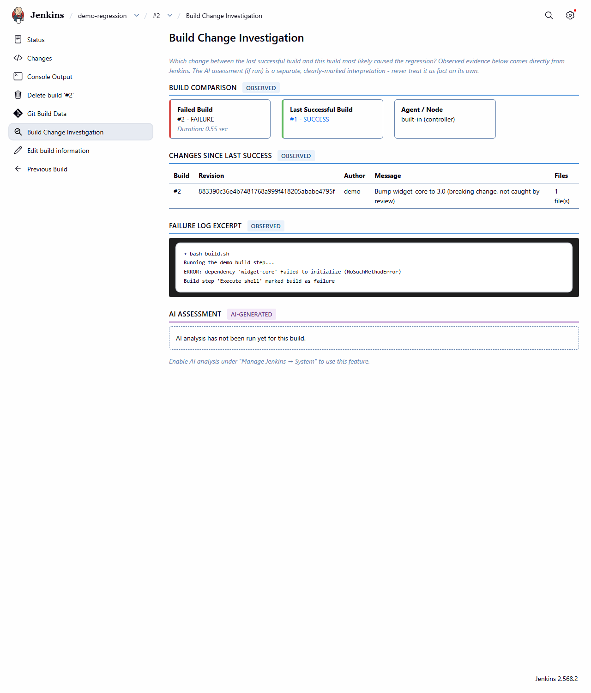
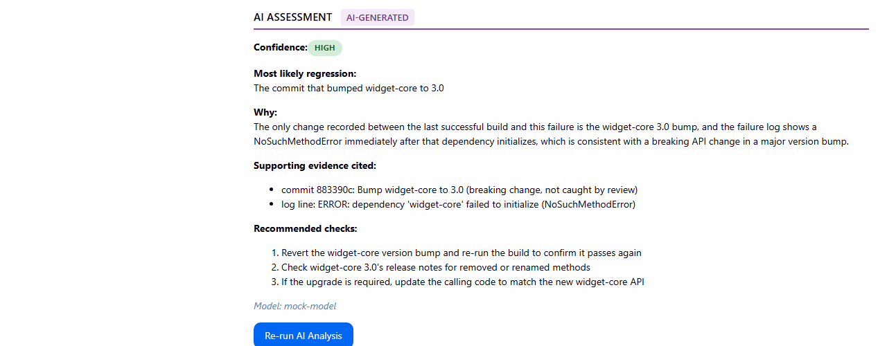

# Build Change Investigator

**"What changed between the last successful build and this failed build, and which change is
most likely responsible for the regression?"**

A Jenkins plugin focused on regression/change correlation for failed builds - not generic
AI-powered error explanation.

> **Repository location:** an [official Jenkins hosting request](https://github.com/jenkins-infra/repository-permissions-updater/issues/5249)
> is open for this plugin. `pom.xml`'s `<url>`/`<scm>` already use the canonical
> `jenkinsci/build-change-investigator-plugin` coordinates required for hosting; until the
> request is approved, the source itself still lives at
> `https://github.com/InfraGuard-Labs/build-change-investigator` - see
> [RELEASE_CHECKLIST.md](RELEASE_CHECKLIST.md#6-future-jenkins-plugin-site-update-center-publication-requirements).

## Table of contents

- [Problem statement](#problem-statement)
- [How this differs from generic AI error-explanation plugins](#how-this-differs-from-generic-ai-error-explanation-plugins)
- [Screenshots](#screenshots)
- [Requirements](#requirements)
- [Installation](#installation)
- [Configuration](#configuration)
- [Usage](#usage)
- [Architecture overview](#architecture-overview)
- [Privacy and security](#privacy-and-security)
- [Example investigation](#example-investigation)
- [Local demo](#local-demo)
- [Limitations](#limitations)
- [Roadmap](#roadmap)
- [Contributing](#contributing)
- [License](#license)

## Problem statement

A build goes from green to red. The console log shows a stack trace, or a failed test, or a
non-zero exit code - but *why now*? Somewhere between the last successful build and this one,
something changed: a commit, a dependency bump, a pipeline edit, a config file. Finding which
change is responsible usually means manually opening the changelog, cross-referencing it
against the failure, and guessing.

Build Change Investigator automates that correlation: it finds the last successful build,
collects everything Jenkins knows about what changed since then, pulls out the parts of the
failure log that look relevant, and (optionally) asks an AI model to point at the most likely
culprit - citing the specific evidence it used, with an explicit confidence level.

## What makes Build Change Investigator different

Build Change Investigator focuses specifically on **regression correlation**.

It compares a failed build with the last successful build, collects the changes between them, correlates those changes with failure evidence, and optionally produces an AI-assisted hypothesis about which change most likely introduced the regression.

Its core question is:

> **Which change since the last successful build most likely caused this failure?**

The plugin combines:

- the last successful build
- the current failed build
- SCM commits and changed files
- revision and author information
- relevant failure-log evidence
- optional AI-assisted analysis with cited supporting evidence and an explicit confidence level

The deterministic evidence remains useful even when AI analysis is disabled.

## Screenshots

## Investigation overview

Build Change Investigator compares the failed build with the last successful build, shows the changes between them, and extracts relevant failure-log evidence.



### AI-assisted regression analysis

When AI analysis is enabled, the plugin uses the observed Jenkins evidence to identify the most likely regression-causing change, explain why, cite supporting evidence, and recommend verification steps.



### Installed in Jenkins

Build Change Investigator runs as a native Jenkins plugin and adds a **Build Change Investigation** action to failed builds.


## Requirements

- Jenkins `2.568.2` or newer (see `jenkins.version` in `pom.xml`).
- Java 21 runtime on the Jenkins controller (matches current Jenkins core requirements).
- The [Credentials](https://plugins.jenkins.io/credentials/) and
  [Plain Credentials](https://plugins.jenkins.io/plain-credentials/) plugins (installed
  automatically as dependencies).
- Optional: an OpenAI-compatible API endpoint (OpenAI itself, Azure OpenAI, a self-hosted
  gateway like LiteLLM/vLLM/Ollama with an OpenAI-compatible `/chat/completions` route, etc.)
  if you want the AI assessment feature. Everything else works without it.

## Installation

1. Build the plugin (see [CONTRIBUTING.md](CONTRIBUTING.md)) to produce
   `target/build-change-investigator.hpi`, or download the `.hpi` from a
   [GitHub Release](https://github.com/InfraGuard-Labs/build-change-investigator/releases) once
   published.
2. In Jenkins, go to **Manage Jenkins → Plugins → Advanced settings → Deploy Plugin** and
   upload the `.hpi` file (or copy it into `$JENKINS_HOME/plugins/` and restart Jenkins).
3. Restart Jenkins if prompted.

See [RELEASE_CHECKLIST.md](RELEASE_CHECKLIST.md) for exact step-by-step instructions.

## Configuration

Go to **Manage Jenkins → System → Build Change Investigator**:

| Field | Description |
|---|---|
| Enable AI analysis | Off by default. Deterministic evidence works regardless of this setting. |
| Base URL | OpenAI-compatible base URL, e.g. `https://api.openai.com/v1`. `/chat/completions` is appended automatically. |
| Model | Model name to request, e.g. `gpt-4o-mini`. |
| API Token Credential | A Jenkins **Secret text** credential holding the provider's API token. Never logged or displayed. |
| Max Log Context Characters | Upper bound on how much (already-reduced, already-redacted) log text is sent to the AI provider. |
| Connection Timeout | Seconds to wait for the AI provider before giving up. |
| Temperature | Sampling temperature; kept low by default. |
| Test Connection | Sends a minimal request to verify the configuration works before relying on it. |

All secrets (the AI provider's API token) are handled exclusively through the Jenkins
Credentials plugin - there is no field anywhere in this plugin for pasting a raw secret, and
v1 does not support custom HTTP headers of any kind (including header-based auth schemes) for
the AI request. If your provider requires an authentication method other than an
`Authorization: Bearer` header, it is not supported in this version.

Only Jenkins administrators (`Jenkins.ADMINISTER`) can view or change these settings, and the
API token value is never exposed back to the browser.

### Permissions

This plugin adds one permission: **`RunChangeInvestigationAnalysis`** (shown in the job
permission matrix under the standard "Item" permissions). It must be **granted explicitly** -
it is deliberately *not* implied by `Item.BUILD` or any other job-trigger permission, since
being trusted to run builds does not, by itself, authorize spending AI provider budget on a
user's behalf. It is implied only by `Jenkins.ADMINISTER`: instance administrators have
effective access to it automatically, the same way they have effective access to everything
else, without needing a redundant separate grant. Viewing an investigation (the observed
evidence and any cached AI result) requires only the standard `Item.READ` permission already
used to view the build itself - no separate permission is needed to look at what's already
there.

## Usage

1. A build fails, goes unstable, or is aborted.
2. Open that build's page. A **"Build Change Investigation"** link appears in the sidebar
   (added automatically - no pipeline/job configuration needed).
3. The page shows, immediately and without any AI call:
   - **BUILD COMPARISON**: the failed build vs. the last successful build.
   - **CHANGES SINCE LAST SUCCESS**: commits/revisions, authors, messages, changed files -
     accumulated across *every* build between the last success and this failure, not just the
     most recent one.
   - **FAILURE LOG EXCERPT**: a bounded, secret-redacted set of log lines around
     error/failure/exception markers (or the log tail, if nothing matched).
   - Any evidence Jenkins could not provide is listed explicitly as a note, never silently
     omitted.
4. If AI analysis is enabled and you have the `RunChangeInvestigationAnalysis` permission, a
   **"Run AI Analysis"** button appears. Clicking it sends the evidence bundle above (and
   nothing else) to the configured endpoint and displays, in a clearly separate
   **AI ASSESSMENT** section:
   - Most likely regression-causing change, with a **LOW / MEDIUM / HIGH** confidence badge.
   - The reasoning, citing specific evidence items.
   - Recommended verification steps.
   - An explicit "insufficient evidence" flag if the model didn't have enough to go on.
5. The result is cached on the build - revisiting the page later shows the same result without
   another API call. Click **"Re-run AI Analysis"** to explicitly request a new one.

## Architecture overview

```
                     ┌─────────────────────────────┐
  build finishes ──▶ │ InvestigationRunListener     │  onCompleted(): deterministic only,
  (worse than        │ (hudson.model.listeners.     │  no network calls to any AI provider
   SUCCESS)          │  RunListener)                │
                     └───────────────┬─────────────┘
                                     ▼
                     ┌─────────────────────────────┐
                     │ EvidenceCollector            │  Run.getPreviousSuccessfulBuild(),
                     │ (evidence package)           │  RunWithSCM#getChangeSets() walked back
                     │  + LogReducer + SecretRedactor│ across every build since last success,
                     └───────────────┬─────────────┘  console log via Run#getLogReader()
                                     ▼
                     ┌─────────────────────────────┐
                     │ BuildInvestigationEvidence   │  attached to the build as
                     │  (persisted with the build)  │  InvestigationAction, shown on
                     └───────────────┬─────────────┘  the build's sidebar page
                                     ▼
                     ┌─────────────────────────────┐
  user clicks    ──▶ │ InvestigationAction#doRunAi  │  permission-checked, POST-only
  "Run AI Analysis"  │                              │
                     └───────────────┬─────────────┘
                                     ▼
                     ┌─────────────────────────────┐
                     │ AiAnalysisService             │  PromptBuilder → OpenAiCompatibleClient
                     │ (ai package)                  │  (java.net.http.HttpClient) →
                     │                                │  AiResponseParser → AiAssessment
                     └─────────────────────────────┘  (also persisted with the build)
```

Key Jenkins extension points used:

- `jenkins.model.RunAction2` - the build-page action (`InvestigationAction`), correctly
  re-attaching its transient `Run` reference across Jenkins restarts via `onLoad`/`onAttached`.
- `hudson.model.listeners.RunListener<Run<?,?>>` - collects deterministic evidence once, at
  build completion, for both freestyle and pipeline builds.
- `jenkins.scm.RunWithSCM` - the SCM-agnostic changelog API (implemented by both
  `AbstractBuild` and `WorkflowRun`), so no Git-specific dependency is needed.
- `jenkins.model.GlobalConfiguration` - the administrator-facing settings page.
- `hudson.security.Permission` - the custom `RunChangeInvestigationAnalysis` permission.
- Jenkins **Credentials API** (`StringCredentials`) - for the AI provider's API token.

## Privacy and security

See [SECURITY.md](SECURITY.md) for the full policy. Summary:

- Deterministic evidence collection never makes a network call to any AI provider.
- The full console log is **never** sent anywhere. A bounded, keyword-selected excerpt is used,
  capped by the administrator-configured character limit.
- Common secret patterns (bearer tokens, `password=`/`api_key=`-style assignments, AWS/GitHub/
  Slack-style keys, JWTs, PEM private key blocks) are redacted from any log text before it is
  stored in evidence or sent to an AI provider - **this is best-effort, not a guarantee**.
- Workspace file *contents* are never read or sent - only SCM-reported file *paths*.
- AI analysis is off by default, requires `Jenkins.ADMINISTER` to configure, and requires a
  separate permission (`RunChangeInvestigationAnalysis`) to actually trigger per build.
- The AI provider's API token is stored only via the Jenkins Credentials plugin and is never
  logged, persisted in plain text elsewhere, or shown back in the UI.

## Example investigation

```
BUILD COMPARISON
Failed Build:            #185 - FAILURE
Last Successful Build:   #184 - SUCCESS
Agent:                   linux-agent-3

CHANGES SINCE LAST SUCCESS
#185  a1b2c3d  alice   "Bump jackson-databind 2.15.0 -> 2.17.0"   [pom.xml]

FAILURE LOG EXCERPT
ERROR: com.fasterxml.jackson.databind.exc.InvalidDefinitionException:
  Cannot construct instance of `com.example.Widget`
Caused by: NoSuchMethodError: 'void com.fasterxml.jackson.databind...'

AI ASSESSMENT                                              [AI-GENERATED]
Confidence: HIGH
Most likely regression: The jackson-databind version bump in commit a1b2c3d.
Why: The only change since the last successful build touches pom.xml's
  jackson-databind version, and the failure log shows a NoSuchMethodError
  inside Jackson's own deserialization code immediately after that bump -
  consistent with a binary-incompatible minor version jump.
Recommended checks:
  1. Pin jackson-databind back to 2.15.0 and re-run the build to confirm.
  2. Check the release notes for 2.17.0 for the specific removed/changed method.
  3. If the bump is required, check for a compatible jackson-databind BOM update.
```

## Local demo

This uses `mvn hpi:run`, the standard Jenkins plugin development workflow, which launches a
throwaway Jenkins instance with the plugin pre-installed.

```bash
./mvnw hpi:run
```

Wait for `Jenkins is fully up and running` in the console, then open
http://localhost:8080/jenkins/.

To see the plugin do something meaningful without needing a real Git server, use the freestyle
demo job described in [`demo/README.md`](demo/README.md): build #1 succeeds, then a source file
changes and build #2 fails, and the build page shows the last successful build, the change, and
the failure evidence exactly as described under [Usage](#usage).

## Limitations

- **Agent/node name is only available for freestyle-style builds** (anything extending
  `AbstractBuild`). Pipeline builds can span multiple agents, so no single "the node" is
  reported for them - this is stated explicitly in the evidence rather than guessed.
- **Change accumulation walks build history up to a safety cap** (200 builds). If far more
  builds separate a failure from the last success, evidence will note it was capped.
- **Secret redaction is pattern-based and best-effort**, not exhaustive - see
  [SECURITY.md](SECURITY.md).
- **One AI provider shape per instance**: this plugin speaks the OpenAI "chat completions" HTTP
  shape. Providers with a fundamentally different API (not exposing an OpenAI-compatible
  `/chat/completions` route) are not supported without a compatibility proxy in front of them.
- **No pipeline-specific step or custom DSL** is provided in v1 - the build-page action works
  automatically for both freestyle and pipeline jobs, which covers the core use case without
  adding pipeline syntax to maintain.
- **The "last known revision" field is a best-effort heuristic** (the most recent commit ID
  seen in the changelog), not a guaranteed authoritative SCM revision pointer, since Jenkins'
  generic changelog API does not expose one uniformly across all SCM plugins.

## Roadmap

Ranked by likely impact, not committed to any timeline:

1. Downloadable Markdown investigation report.
2. Compact confidence/risk badge visible directly on the build history list, not just the
   investigation page.
3. Folder-level configuration overrides (similar in spirit to per-folder AI settings in other
   plugins), so different teams can use different models/providers.
4. Pipeline step (`investigateChanges()`) for teams that want to gate `post` blocks on the
   result.
5. Optional Git-specific enrichment (e.g., linking to a configured repository browser) as a
   cleanly isolated, opt-in addition - without making Git a hard dependency.

## Contributing

See [CONTRIBUTING.md](CONTRIBUTING.md).

## License

[MIT](LICENSE).
