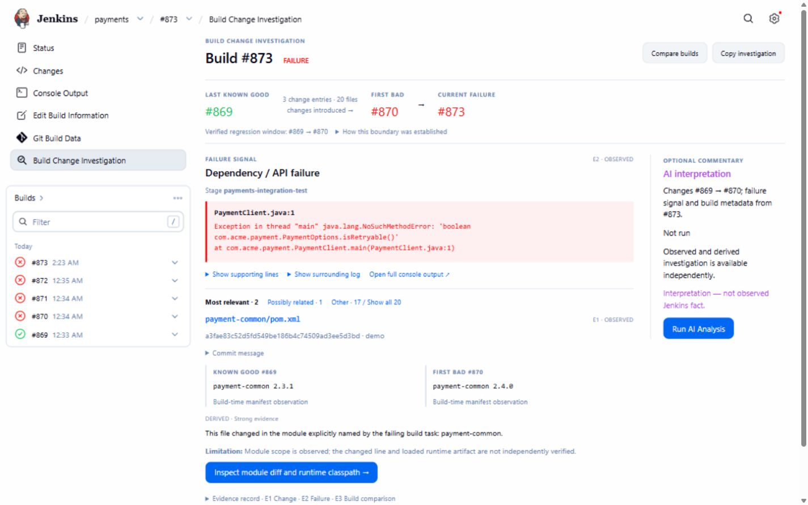
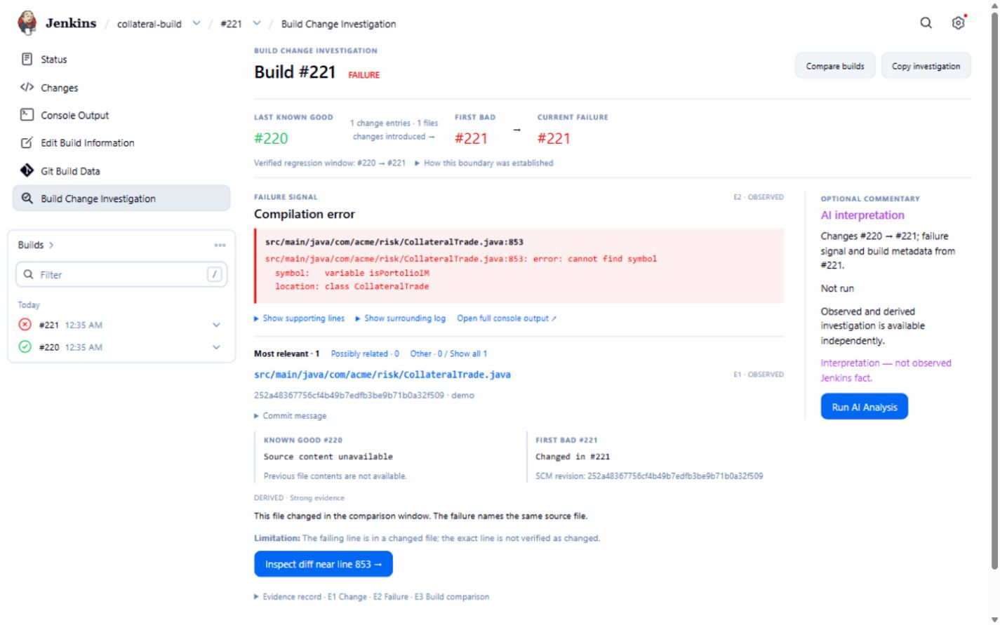
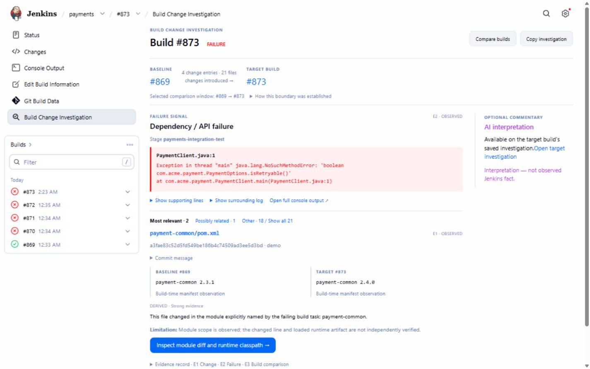
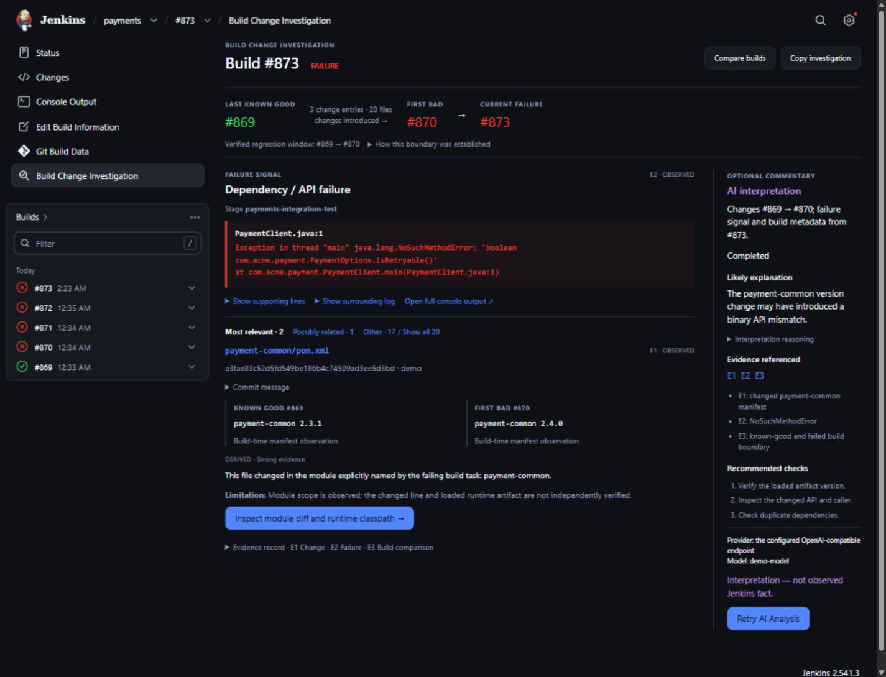

# Build Change Investigator

A Jenkins plugin that helps answer: **“What changed between the last successful build and the failed build, and which changes are most likely related?”**

Compare the failed build with the last known good. Extract the exact failure signal and rank relevant code/config changes using deterministic evidence. Optional AI can interpret the evidence; it is not required.

[Install from Jenkins](https://plugins.jenkins.io/build-change-investigator/)

*Dependency regression: a narrowed change window, stage-aware ranking, and native Build History.*

## Why it is different

Logs, error summaries, and generic AI explanations describe a failure. Build Change Investigator connects it to what changed:

**Last known good → changes introduced → first bad → current failure → exact evidence → what to check next.**

The core investigation works without asking AI to guess a root cause. Observed facts, deterministic correlations, and optional AI interpretation stay distinct. Weak evidence is reported as such.

## How it works

1. A build fails, becomes unstable, or is aborted.
2. The plugin finds the last successful build.
3. It collects SCM changes and relevant failure evidence.
4. It ranks changes overlapping the failing file, module, or stage.
5. It shows the investigation on the Jenkins build page.

When retained history is sufficient, it identifies a verified first-bad build and narrows the change window. Missing evidence stays explicit.

## What you get

- Exact failure signals: compiler diagnostics, exceptions, and failing tests.
- Last-good → first-bad → current investigation flow.
- Stage-aware change ranking, with the full retained change set available.
- Build-to-build comparison within the same job.
- Similar past failure context.
- **Copy investigation** with evidence and suggested checks.
- Optional AI interpretation, separate from observed facts.
- Native Jenkins Build History and light/dark layouts that adapt to narrower screens.

## Screenshots

Real V3 runtime captures using synthetic demo data.

*Relevant changes ranked by failure and stage evidence.*

Compilation failure

*See the unresolved symbol, source location, and first diff to inspect.*

Build-to-build comparison

*Choose a comparison window using the same investigation view.*

Optional AI interpretation · dark mode

*Evidence references and recommended checks remain separate from observed facts.*

## Install

Open **Manage Jenkins → Plugins → Available plugins**, search for **Build Change Investigator**, and install it. Restart Jenkins if requested. [Official plugin page](https://plugins.jenkins.io/build-change-investigator/).

## Use

No Jenkinsfile changes are required. After a new build finishes as **FAILURE**, **UNSTABLE**, or **ABORTED**, open it and select **Build Change Investigation**. The deterministic investigation is available immediately; full Console Output remains accessible.

If AI is configured, an authorized user can click **Run AI Analysis**. Page loads never trigger AI calls.

## Optional AI

AI is optional; regression investigation works without it. Supported providers are OpenAI, Anthropic Claude, AWS Bedrock, Azure OpenAI, Google Gemini, Ollama, and OpenAI-compatible endpoints. Configure a provider under **Manage Jenkins → System → Build Change Investigator**. API keys use Jenkins Credentials; Bedrock also supports the AWS default credential chain.

## Optional Slack notifications

Under **Manage Jenkins → System → Build Change Investigator — Slack**, enable Slack integration, select a bot **Secret text** credential, enter a default channel, and use **Test Connection**. Then opt in each job under **Build Change Investigator Notifications**. Jobs default to off; global setup does not enable them or backfill old builds. A job may override the channel while using the administrator's bot credential.

The first investigation posts a compact evidence-first message. Unchanged failures stay quiet; material evidence updates and verified recovery reply in the same thread. A successful build alone does not prove recovery. Optional responder mappings and first-message tagging are under **Advanced**. When AI is enabled and configured, a Slack-enabled job can request one analysis for the same investigation evidence, reusing an existing result or in-flight request. The initial notification waits up to 30 seconds, then falls back to deterministic evidence; late AI completion never creates another reply.

See [Slack setup and behavior](docs/SLACK.md) for bot scopes, recovery coverage, and delivery limitations.

## Requirements

- Jenkins **2.541.3** or newer.
- Java **17**, **21**, or a newer runtime supported by your Jenkins version.
- SCM change information for the richest investigation experience.

## Security

Deterministic investigation runs locally in Jenkins. AI runs on an explicit request or for a Slack-enabled job when global AI is configured and enabled. Credentials use Jenkins Credentials, and submitted evidence is bounded with best-effort secret redaction. See the [security policy](SECURITY.md).

## Links

[Jenkins plugin page](https://plugins.jenkins.io/build-change-investigator/) · [GitHub repository](https://github.com/jenkinsci/build-change-investigator-plugin) · [Issues](https://github.com/jenkinsci/build-change-investigator-plugin/issues)
