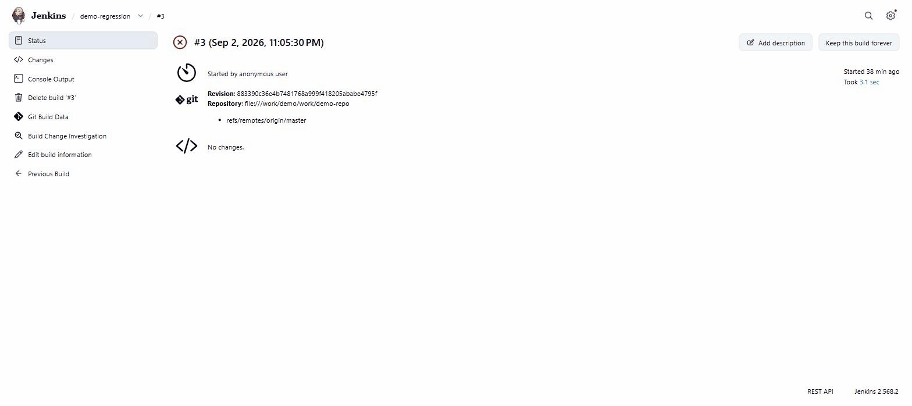
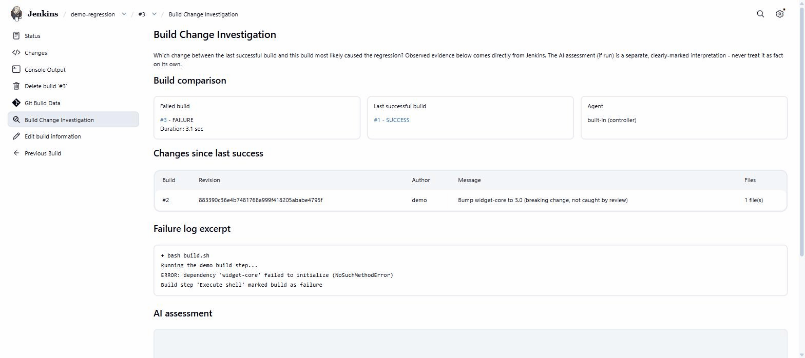
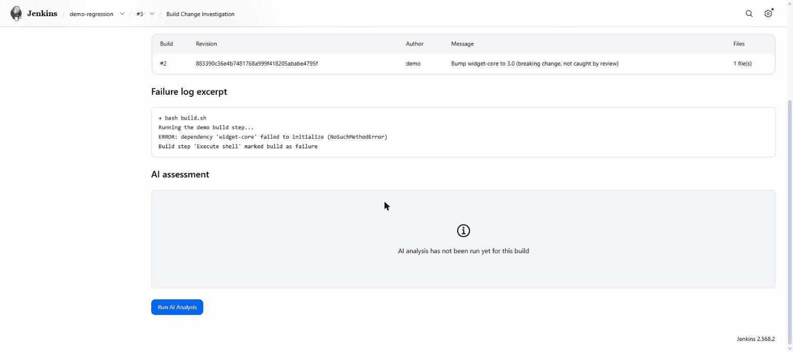
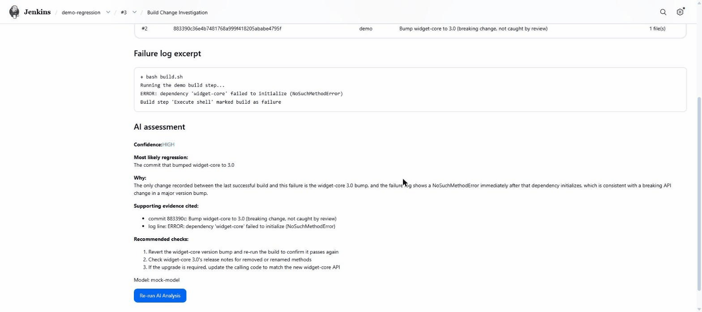

# Build Change Investigator

**"What changed between the last successful build and this failed build, and which change is
most likely responsible for the regression?"**

A Jenkins plugin focused on regression/change correlation for failed builds - not generic
AI-powered error explanation.

Build Change Investigator is an official Jenkins plugin, hosted under the
[`jenkinsci`](https://github.com/jenkinsci/build-change-investigator-plugin) GitHub
organization and published on the
[Jenkins plugin site](https://plugins.jenkins.io/build-change-investigator/).

## Table of contents

- [Installation](#installation)
- [Requirements](#requirements)
- [How it works](#how-it-works)
  - [Quick example](#quick-example)
- [What the investigation shows](#what-the-investigation-shows)
- [Optional AI-assisted analysis](#optional-ai-assisted-analysis)
- [Supported AI providers](#supported-ai-providers)
- [Configuration](#configuration)
- [Problem statement](#problem-statement)
- [How this differs from generic AI error-explanation plugins](#how-this-differs-from-generic-ai-error-explanation-plugins)
- [Architecture overview](#architecture-overview)
- [Privacy and security](#privacy-and-security)
- [Example investigation](#example-investigation)
- [Local demo](#local-demo)
- [Limitations](#limitations)
- [Roadmap](#roadmap)
- [Contributing](#contributing)
- [License](#license)

## Installation

### Install from Jenkins Plugin Manager

Build Change Investigator is available through the Jenkins Plugin Manager.

1. Open Jenkins.
2. Go to **Manage Jenkins → Plugins**.
3. Select **Available plugins**.
4. Search for **Build Change Investigator**.
5. Select the plugin and click **Install**.
6. Restart Jenkins if Jenkins requests or recommends it (a restart is not always required, but
   Jenkins will tell you if this plugin needs one).

Official plugin page: <https://plugins.jenkins.io/build-change-investigator/>

### Manual installation (advanced / offline instances)

If you need to install the `.hpi` file directly instead - for example, on an instance without
internet access to the Update Center:

1. Download the `.hpi` from the [plugin page](https://plugins.jenkins.io/build-change-investigator/),
   or build it yourself (see [Contributing](#contributing)) to produce
   `target/build-change-investigator.hpi`.
2. In Jenkins, go to **Manage Jenkins → Plugins → Advanced settings → Deploy Plugin** and upload
   the `.hpi` file (or copy it into `$JENKINS_HOME/plugins/` and restart Jenkins).
3. Restart Jenkins if prompted.

Normal users installing on a Jenkins instance with internet access should use the Plugin Manager
method above.

## Requirements

- Jenkins `2.541.3` or newer (see `jenkins.version` in `pom.xml`).
- Java 17, 21, or 25 on the Jenkins controller - this plugin targets Java 17 and has been
  verified running on all three, matching the Java versions the `2.541.x` Jenkins LTS line
  itself supports.
- The [Credentials](https://plugins.jenkins.io/credentials/),
  [Plain Credentials](https://plugins.jenkins.io/plain-credentials/), and
  [Ionicons API](https://plugins.jenkins.io/ionicons-api/) plugins (installed automatically as
  dependencies - no manual action needed).
- Optional: an OpenAI-compatible chat-completions API endpoint if you want the AI assessment
  feature - see [Supported AI providers](#supported-ai-providers) for exactly what that does
  and does not include. Everything else works without it.

## How it works

**No Jenkinsfile changes are required.** Build Change Investigator integrates with Jenkins'
build lifecycle directly (a `RunListener`) rather than requiring a pipeline step or any job
configuration - it works automatically for both Freestyle and Pipeline jobs.

An investigation is recorded automatically whenever a build finishes with a result **worse than
`SUCCESS`** - that is, `FAILURE`, `UNSTABLE`, or `ABORTED` (a build that never actually ran,
`NOT_BUILT`, is skipped, since there is nothing to investigate). Builds that finish successfully
never get an investigation and are never contacted by any AI provider.

For example:

```
Build #41 — SUCCESS
Build #42 — FAILURE
```

When build #42 fails, Build Change Investigator records an investigation for that build. Open
build #42's page, and a **Build Change Investigation** link appears automatically in the left
sidebar (no configuration needed). Selecting it opens the investigation page, which shows the
deterministic evidence collected for the regression - starting with a comparison against the
last build that succeeded (build #41 here).



*Build Change Investigation appears directly on the affected build.*

If a job has no previous successful build (its first build ever fails, or every prior build also
failed), the investigation still opens and says so explicitly rather than guessing or comparing
against nothing.

### Quick example

1. Run a Jenkins job successfully.
2. Make a change that causes the next build to fail.
3. Run the job again.
4. Open the failed build.
5. Select **Build Change Investigation** in the sidebar.
6. Review the changes between the last successful build and the failed build.

Meaningful change correlation depends on Jenkins actually having SCM/change information for the
job (see [What the investigation shows](#what-the-investigation-shows) below) - a job with no
SCM configured will still show failure-log evidence, just no commit/change evidence.

## What the investigation shows

The investigation page shows two clearly separated kinds of information:



*The investigation compares the current build with the last successful build and presents observed change and failure evidence.*

**Deterministic observed evidence** - collected the moment the build finishes, with no AI
involvement and no network call to any AI provider:

- The failed (or unstable/aborted) build vs. the last successful build, with a link to each.
- Agent/node name, where available (see [Limitations](#limitations) for when it isn't).
- SCM changes since the last successful build: commits/revisions, authors, messages, and
  changed files, accumulated across every intervening build, not just the most recent one.
- A bounded, secret-redacted excerpt of the failure log, focused around
  error/failure/exception markers.
- Explicit notes for anything Jenkins could not provide (e.g. no prior successful build, no SCM
  changes reported, agent info unavailable for a Pipeline build) - evidence gaps are always
  stated, never silently omitted or guessed.

**Optional AI-assisted analysis** - see [below](#optional-ai-assisted-analysis).

This deterministic evidence is available on every investigation, regardless of whether AI
analysis is configured at all.

## Optional AI-assisted analysis

**AI-assisted analysis is optional.** Build Change Investigator's core value - deterministic
build/change correlation - works fully without any AI provider configured. AI is not required
for the plugin to function, and it is not the plugin's primary purpose.



*The deterministic investigation is available without configuring an AI provider.*

- Observed build evidence is collected independently of AI, for every applicable build, whether
  or not AI analysis is enabled.
- Simply opening the investigation page never triggers an AI request.
- AI analysis is off by default and must be explicitly enabled by an administrator
  (see [Configuration](#configuration)).
- Even when enabled, a specific AI request only happens when an authorized user clicks
  **Run AI Analysis** on a given investigation - never automatically.
- When run, AI analysis operates only on the evidence already collected above (job/build
  metadata, SCM changes, the redacted log excerpt) - never the full console log, credentials, or
  workspace file contents.
- The result - most likely regression-causing change, reasoning citing specific evidence, an
  explicit confidence level (`LOW`/`MEDIUM`/`HIGH`), and recommended verification steps - is
  shown in a section clearly separate from the observed evidence, and is cached on the build so
  revisiting the page later doesn't trigger another request. Click **Re-run AI Analysis** to
  explicitly request a new one.



*Optional AI-assisted analysis shown using the project's local demo provider. The deterministic
investigation works independently of AI.*

## Supported AI providers

Build Change Investigator works with **OpenAI-compatible chat-completions APIs**. It does not
require OpenAI specifically - any endpoint that accepts a `POST {base URL}/chat/completions`
request in the OpenAI request/response shape can be configured.

**What the plugin actually sends and expects:** a JSON body containing `model` (exactly what
you type into the Model field), `temperature`, and a two-message `messages` array (`system` +
`user`) - no `max_tokens` or other fields. It reads the response as
`choices[0].message.content`, matching OpenAI's own non-streaming chat-completions response
shape. Authentication is always a single `Authorization: Bearer <token>` header, sourced from a
Jenkins **Secret text** credential - there is no support for a custom header name, an
`api-key`-style header, extra query parameters, or unauthenticated requests. A credential must
always be selected, even when the target server itself does not check it.

**Models are not hardcoded.** There is no allowlist - the `Model` field is sent to the endpoint
exactly as typed, so any model identifier your configured endpoint accepts will be requested
as-is.

### Support matrix

Statuses reflect whether the provider's documented API contract matches what this plugin sends,
not a live integration test against that provider - the automated test suite exercises this
contract against a local mock server, not against any of these services directly.

| Provider / API style | Status | Notes |
|---|---|---|
| OpenAI | Confirmed compatible | The native shape this plugin implements; `Authorization: Bearer` matches OpenAI's own auth. |
| OpenRouter | Likely compatible | Documented endpoint (`https://openrouter.ai/api/v1/chat/completions`) and `Authorization: Bearer` auth match this plugin's request shape exactly. |
| LiteLLM proxy | Likely compatible | Documented to expose `/v1/chat/completions` with `Authorization: Bearer <virtual key>` - matches. |
| vLLM (OpenAI-compatible server) | Likely compatible | Documented `/v1/chat/completions` endpoint; Bearer auth is optional server-side, and any token value satisfies this plugin's "a credential must be set" requirement. |
| Ollama (OpenAI-compatible API) | Likely compatible | `http://<host>:11434/v1/chat/completions` matches; Ollama does not check the API key, so a placeholder Jenkins credential value works. |
| LM Studio | Likely compatible | Exposes a local OpenAI-compatible `/v1/chat/completions`-shaped endpoint that tolerates a Bearer header per its own documentation. |
| Azure OpenAI | **Not supported as implemented** | Azure's chat-completions endpoint requires the path `/openai/deployments/{deployment}/chat/completions` plus a mandatory `?api-version=` query parameter, and its primary auth is an `api-key` header (`Authorization: Bearer` is only valid for short-lived Microsoft Entra ID tokens, which this plugin has no mechanism to refresh). This plugin always calls a fixed `{base URL}/chat/completions` with a static `Authorization: Bearer` header and no query-string support, so it cannot express Azure's required request shape. |
| Any other OpenAI-compatible gateway not listed above | Unverified | Compatibility depends entirely on whether it accepts a plain `{base URL}/chat/completions` POST with `Authorization: Bearer` and returns `choices[0].message.content`. |

### Models

Model names are not hardcoded; use the model identifier expected by your configured endpoint
(for example `gpt-4o-mini` for OpenAI, or a local model name for Ollama/vLLM/LM Studio). A
non-OpenAI model such as a Claude or Llama model is only reachable through an OpenAI-compatible
gateway/proxy that translates the request into that model's own API - this plugin never talks
to Anthropic's or any other vendor's native API directly.

## Configuration

Go to **Manage Jenkins → System → Build Change Investigator**:

| Field | Description |
|---|---|
| Enable AI analysis of investigations | Off by default. Deterministic evidence works regardless of this setting; the fields below only appear once this is checked. |
| Base URL | OpenAI-compatible base URL, e.g. `https://api.openai.com/v1`. `/chat/completions` is appended automatically. |
| Model | Model name to request, e.g. `gpt-4o-mini`. |
| API Token Credential | A Jenkins **Secret text** credential holding the provider's API token. Never logged or displayed. |
| Max Log Context Characters | Upper bound on how much (already-reduced, already-redacted) log text is sent to the AI provider. |
| Connection Timeout (seconds) | Seconds to wait for the AI provider before giving up. |
| Temperature | Sampling temperature; kept low by default. |
| Test Connection | Sends a minimal request to verify the configuration works before relying on it. |

All secrets (the AI provider's API token) are handled exclusively through the Jenkins
Credentials plugin - there is no field anywhere in this plugin for pasting a raw secret, and
v1 does not support custom HTTP headers of any kind (including header-based auth schemes) for
the AI request. If your provider requires an authentication method other than an
`Authorization: Bearer` header, it is not supported in this version.

Only Jenkins administrators (`Jenkins.ADMINISTER`) can view or change these settings, and the
API token value is never exposed back to the browser.

### Permissions

This plugin adds one permission: **`RunChangeInvestigationAnalysis`**, scoped to individual
builds (the same permission group Jenkins core uses for its own per-build permissions like
Run/Delete and Run/Update) rather than to the job as a whole. It must be **granted explicitly**
- it is deliberately *not* implied by `Item.BUILD` or any other job-trigger permission, since
being trusted to run builds does not, by itself, authorize spending AI provider budget on a
user's behalf. It is implied only by `Jenkins.ADMINISTER`: instance administrators have
effective access to it automatically, the same way they have effective access to everything
else, without needing a redundant separate grant. Viewing an investigation (the observed
evidence and any cached AI result) requires only the standard `Item.READ` permission already
used to view the build itself - no separate permission is needed to look at what's already
there.

## Problem statement

A build goes from green to red. The console log shows a stack trace, or a failed test, or a
non-zero exit code - but *why now*? Somewhere between the last successful build and this one,
something changed: a commit, a dependency bump, a pipeline edit, a config file. Finding which
change is responsible usually means manually opening the changelog, cross-referencing it
against the failure, and guessing.

Build Change Investigator automates that correlation: it finds the last successful build,
collects everything Jenkins knows about what changed since then, pulls out the parts of the
failure log that look relevant, and (optionally) asks an AI model to point at the most likely
culprit - citing the specific evidence it used, with an explicit confidence level.

## How this differs from generic AI error-explanation plugins

Build Change Investigator focuses specifically on **regression correlation**.

It compares a failed build with the last successful build, collects the changes between them, correlates those changes with failure evidence, and optionally produces an AI-assisted hypothesis about which change most likely introduced the regression.

Its core question is:

> **Which change since the last successful build most likely caused this failure?**

The plugin combines:

- the last successful build
- the current failed build
- SCM commits and changed files
- revision and author information
- relevant failure-log evidence
- optional AI-assisted analysis with cited supporting evidence and an explicit confidence level

The deterministic evidence remains useful even when AI analysis is disabled.

## Architecture overview

```
                     ┌─────────────────────────────┐
  build finishes ──▶ │ InvestigationRunListener     │  onCompleted(): deterministic only,
  (worse than        │ (hudson.model.listeners.     │  no network calls to any AI provider
   SUCCESS)          │  RunListener)                │
                     └───────────────┬─────────────┘
                                     ▼
                     ┌─────────────────────────────┐
                     │ EvidenceCollector            │  Run.getPreviousSuccessfulBuild(),
                     │ (evidence package)           │  RunWithSCM#getChangeSets() walked back
                     │  + LogReducer + SecretRedactor│ across every build since last success,
                     └───────────────┬─────────────┘  console log via Run#getLogReader()
                                     ▼
                     ┌─────────────────────────────┐
                     │ BuildInvestigationEvidence   │  attached to the build as
                     │  (persisted with the build)  │  InvestigationAction, shown on
                     └───────────────┬─────────────┘  the build's sidebar page
                                     ▼
                     ┌─────────────────────────────┐
  user clicks    ──▶ │ InvestigationAction#doRunAi  │  permission-checked, POST-only
  "Run AI Analysis"  │                              │
                     └───────────────┬─────────────┘
                                     ▼
                     ┌─────────────────────────────┐
                     │ AiAnalysisService             │  PromptBuilder → OpenAiCompatibleClient
                     │ (ai package)                  │  (java.net.http.HttpClient) →
                     │                                │  AiResponseParser → AiAssessment
                     └─────────────────────────────┘  (also persisted with the build)
```

Key Jenkins extension points used:

- `jenkins.model.RunAction2` - the build-page action (`InvestigationAction`), correctly
  re-attaching its transient `Run` reference across Jenkins restarts via `onLoad`/`onAttached`.
- `hudson.model.listeners.RunListener<Run<?,?>>` - collects deterministic evidence once, at
  build completion, for both freestyle and pipeline builds.
- `jenkins.scm.RunWithSCM` - the SCM-agnostic changelog API (implemented by both
  `AbstractBuild` and `WorkflowRun`), so no Git-specific dependency is needed.
- `jenkins.model.GlobalConfiguration` - the administrator-facing settings page.
- `hudson.security.Permission` - the custom `RunChangeInvestigationAnalysis` permission.
- Jenkins **Credentials API** (`StringCredentials`) - for the AI provider's API token.
- Outbound AI requests are made through `hudson.ProxyConfiguration.newHttpClientBuilder()`, so
  they honor the Jenkins instance's own configured HTTP proxy.

## Privacy and security

See [SECURITY.md](SECURITY.md) for the full policy and for how to report a vulnerability.
Summary:

- Deterministic evidence collection never makes a network call to any AI provider.
- The full console log is **never** sent anywhere. A bounded, keyword-selected excerpt is used,
  capped by the administrator-configured character limit.
- Common secret patterns (bearer tokens, `password=`/`api_key=`-style assignments, AWS/GitHub/
  Slack-style keys, JWTs, PEM private key blocks) are redacted from any log text before it is
  stored in evidence or sent to an AI provider - **this is best-effort, not a guarantee**.
- Workspace file *contents* are never read or sent - only SCM-reported file *paths*.
- AI analysis is off by default, requires `Jenkins.ADMINISTER` to configure, and requires a
  separate permission (`RunChangeInvestigationAnalysis`) to actually trigger per build.
- The AI provider's API token is stored only via the Jenkins Credentials plugin and is never
  logged, persisted in plain text elsewhere, or shown back in the UI. There is no configuration
  field for pasting a raw API token directly into the plugin.

## Example investigation

```
Build comparison
Failed build:            #185 - FAILURE
Last successful build:   #184 - SUCCESS
Agent:                    linux-agent-3

Changes since last success
#185  a1b2c3d  alice   "Bump jackson-databind 2.15.0 -> 2.17.0"   [pom.xml]

Failure log excerpt
ERROR: com.fasterxml.jackson.databind.exc.InvalidDefinitionException:
  Cannot construct instance of `com.example.Widget`
Caused by: NoSuchMethodError: 'void com.fasterxml.jackson.databind...'

AI assessment
Confidence: HIGH
Most likely regression: The jackson-databind version bump in commit a1b2c3d.
Why: The only change since the last successful build touches pom.xml's
  jackson-databind version, and the failure log shows a NoSuchMethodError
  inside Jackson's own deserialization code immediately after that bump -
  consistent with a binary-incompatible minor version jump.
Recommended checks:
  1. Pin jackson-databind back to 2.15.0 and re-run the build to confirm.
  2. Check the release notes for 2.17.0 for the specific removed/changed method.
  3. If the bump is required, check for a compatible jackson-databind BOM update.
```

## Local demo

This uses `mvn hpi:run`, the standard Jenkins plugin development workflow, which launches a
throwaway Jenkins instance with the plugin pre-installed.

```bash
./mvnw hpi:run
```

Wait for `Jenkins is fully up and running` in the console, then open
http://localhost:8080/jenkins/.

To see the plugin do something meaningful without needing a real Git server, use the freestyle
demo job described in [`demo/README.md`](demo/README.md): build #1 succeeds, then a source file
changes and build #2 fails, and the build page shows the last successful build, the change, and
the failure evidence exactly as described under [How it works](#how-it-works).

## Limitations

- **Agent/node name is only available for freestyle-style builds** (anything extending
  `AbstractBuild`). Pipeline builds can span multiple agents, so no single "the node" is
  reported for them - this is stated explicitly in the evidence rather than guessed.
- **A previous successful build is not required, but there is nothing to compare against
  without one.** If a job's first build fails, or no prior build ever succeeded, the
  investigation still opens and states this explicitly instead of comparing against nothing.
- **Change accumulation walks build history up to a safety cap** (200 builds). If far more
  builds separate a failure from the last success, evidence will note it was capped.
- **Secret redaction is pattern-based and best-effort**, not exhaustive - see
  [SECURITY.md](SECURITY.md).
- **One AI provider shape per instance**: this plugin speaks the OpenAI "chat completions" HTTP
  shape. Providers with a fundamentally different API (not exposing an OpenAI-compatible
  `/chat/completions` route) are not supported without a compatibility proxy in front of them.
- **AI analysis is probabilistic and advisory, not authoritative** - it is a clearly-marked
  interpretation of the observed evidence, not a fact, and should be verified like any other
  hypothesis.
- **No pipeline-specific step or custom DSL** is provided in v1 - the build-page action works
  automatically for both freestyle and pipeline jobs, which covers the core use case without
  adding pipeline syntax to maintain.
- **The "last known revision" field is a best-effort heuristic** (the most recent commit ID
  seen in the changelog), not a guaranteed authoritative SCM revision pointer, since Jenkins'
  generic changelog API does not expose one uniformly across all SCM plugins.

## Roadmap

Ranked by likely impact, not committed to any timeline:

1. Downloadable Markdown investigation report.
2. Compact confidence/risk badge visible directly on the build history list, not just the
   investigation page.
3. Folder-level configuration overrides (similar in spirit to per-folder AI settings in other
   plugins), so different teams can use different models/providers.
4. Pipeline step (`investigateChanges()`) for teams that want to gate `post` blocks on the
   result.
5. Optional Git-specific enrichment (e.g., linking to a configured repository browser) as a
   cleanly isolated, opt-in addition - without making Git a hard dependency.

## Contributing

See [CONTRIBUTING.md](CONTRIBUTING.md).

## License

[MIT](LICENSE).
